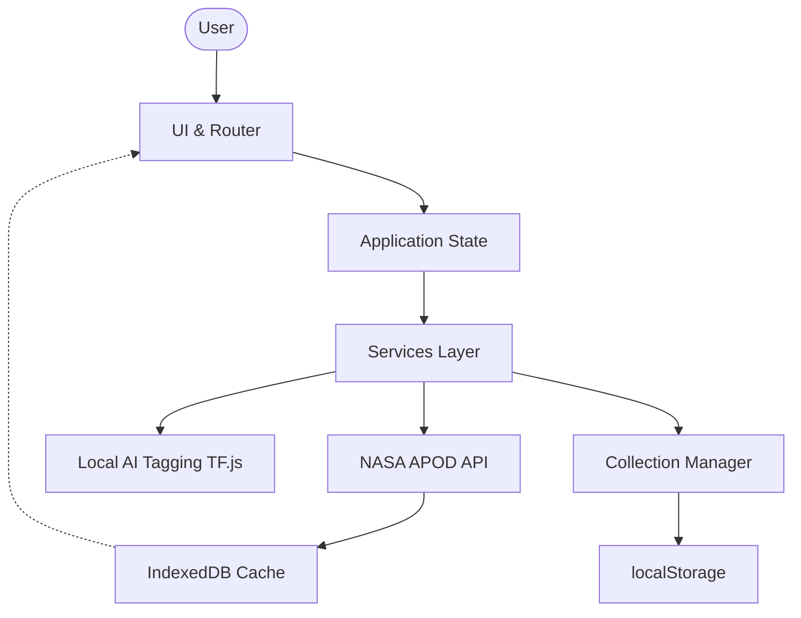

# 🌌 Cosmic APOD

> **Explore the universe, one picture at a time.**


**Cosmic APOD** is an immersive, lightning-fast discovery platform for the NASA Astronomy Picture of the Day (APOD). Built entirely with Vanilla JavaScript and Vite, it delivers a modern digital observatory experience directly in your browser—without the overhead of heavy frameworks or external backend databases.

---

## 📸 Screenshots

*(Placeholder: Add screenshots of Dashboard, Explorer, Date Range, AI Tags, and Settings here)*

---

## ✨ What's New in V3?

Version 3 transforms Cosmic APOD from a simple viewer into a smart, resilient discovery engine.

### 🤖 Local AI Image Tagging
Using **TensorFlow.js** and the **MobileNet** model, V3 can intelligently tag space images directly on your device. 
- **Privacy-First:** Images are analyzed in your browser using WebGL. No data is sent to a third-party server for inference.
- **Lightning Fast:** The 1.8MB neural network is **lazy-loaded**—it only downloads and executes when you explicitly click "✨ Generate AI Tags," keeping initial page loads blazing fast.

### 📅 Date-Range Explorer
Travel through the archives with precision.
- Select custom **Start** and **End** dates.
- Use quick presets like **Last 7 Days**, **Last 30 Days**, or **This Year**.
- Fetches are batched and paginated to prevent browser lockups.

### 🔗 Shareable Collections
Curate your favorite cosmos photos and share them with the world.
- Collections are completely **browser-based**—no cloud accounts required.
- Clicking a share link generates a URL containing a serialized Base64 payload.
- When friends open your link, they are greeted with a beautiful preview modal detailing the collection size before they import it locally.

### 🚦 Smart NASA API Rate-Limit Handling
NASA's public API limits IP addresses to 30 requests per hour. Cosmic APOD handles this gracefully:
- Automatically detects `429 Too Many Requests`.
- Displays a user-friendly UI explaining the rate limit.
- Serves cached content seamlessly when the network goes down or limits are hit.

### 🔑 Bring Your Own NASA API Key
Power users can unlock 1,000 requests per hour by providing their own NASA API key.
- **Where to get one:** [api.nasa.gov](https://api.nasa.gov/)
- **How to add it:** Head to the **Settings** tab and paste your key. It's stored securely in your browser's `localStorage`.
- **⚠️ Security Note:** Because Cosmic APOD is 100% frontend-only, API keys are saved locally. You should only use keys intended for client-side usage, as they will be attached to outgoing browser requests.

---

## 🧭 Feature Overview

| Feature | Description |
|---|---|
| **Dashboard** | Daily APOD discovery experience with "On This Day" throwbacks. |
| **Explorer** | Browse the massive APOD archive with layouts and filters. |
| **Date Range** | Batch fetch APODs between specific timelines. |
| **AI Tags** | Browser-side intelligent image tagging via TF.js. |
| **Favorites** | Save and quickly access your favorite APODs locally. |
| **Collections** | Organize APOD discoveries into shareable curations. |
| **Share** | Share individual APODs or entire customized collections. |
| **Offline-First** | Access cached content even when you have no internet. |
| **API Resilience**| Smart NASA API error handling and BYO-Key support. |
| **Accessibility** | Keyboard traps, focus states, and reduced motion compliance. |

---

## 🧠 Architecture

Cosmic APOD relies on a strict **Frontend-Only** architecture. 



### ⚡ Performance Considerations
- **No Heavy Frameworks:** Built in Vanilla JS to maximize parsing speeds and reduce bundle size.
- **Lazy Module Loading:** The TensorFlow.js engine is code-split and only fetched on demand.
- **AbortController:** Rapidly navigating between days cancels in-flight API requests instantly, saving bandwidth and preventing race conditions.
- **IndexedDB:** Massive JSON payloads are stored in IndexedDB to bypass the 5MB `localStorage` limit.

---

## 💾 Storage & Offline Experience

1. **localStorage:** Used exclusively for lightweight preferences (Theme, Default View, Custom API Key).
2. **IndexedDB:** Stores the heavy APOD payload cache (Titles, Explanations, Dates, URLs).
3. **Service Worker (`sw.js`):** Intercepts network requests and serves static assets and cached APOD data for a true offline fallback experience.

---

## 🛠 Tech Stack

| Technology | Purpose |
|---|---|
| **Vite** | Lightning-fast build tooling and dev server |
| **Vanilla JavaScript** | Core application logic and routing |
| **CSS Variables** | Theming, layout, and design system |
| **NASA APOD API** | Primary astronomy data source |
| **IndexedDB** | Large browser-side asynchronous storage |
| **TensorFlow.js** | Local machine-learning image tagging |
| **Vercel Analytics** | Privacy-friendly pageview analytics |

---

## 📁 Project Structure

```text
├── index.html           # Main entry point & HTML skeleton
├── public/              # Static assets and Service Worker (sw.js)
├── src/
│   ├── api/             # NASA API fetching and IndexedDB cache logic
│   ├── components/      # UI Modals, Settings, Favorites, Collections
│   ├── services/        # Lazy-loaded TensorFlow ML models
│   ├── state/           # Centralized reactive state store
│   ├── utils/           # Date formatting, DOM helpers, string parsers
│   ├── views/           # Page controllers (Dashboard, Explorer)
│   ├── index.css        # Global CSS variables and styling
│   └── main.js          # App initialization and DOM event binding
└── package.json         # Dependencies and scripts
```

---

## 🚀 Setup & Local Development

1. **Clone the repository:**
   ```bash
   git clone https://github.com/yourusername/cosmic-apod.git
   cd cosmic-apod
   ```

2. **Install dependencies:**
   ```bash
   npm install
   ```

3. **Start the development server:**
   ```bash
   npm run dev
   ```

> **Note on Environment Variables:** You can optionally provide a `VITE_NASA_API_KEY` in a `.env.local` file for development, but users can always provide their own via the UI.

---

## 🌐 Deployment

This project is optimized for deployment on Vercel, Netlify, or GitHub Pages.

1. Build the production application:
   ```bash
   npm run build
   ```
2. The compiled static files will be located in the `dist/` directory, ready to be served by any static web host.

---

## ♿ Accessibility

Cosmic APOD respects user preferences:
- Full **Keyboard Navigation** with visible `:focus-visible` outlines.
- Custom Lightbox modals successfully **trap focus**.
- Respects OS-level `prefers-reduced-motion` to disable heavy CSS animations.
- Accessible **Toast Notifications** instead of intrusive browser `alert()` popups.

---

## 🔄 Evolution (V1 → V2 → V3)

| Area | V1 | V2 | V3 (Current) |
|---|---|---|---|
| **Discovery** | Basic APOD | Dashboard + Explorer | Date-Range Explorer |
| **Organization** | Favorites | Themes + Settings | Shareable Collections |
| **Networking** | Basic fetch | Memory Caching | Resilient API + Rate Limit UI |
| **Storage** | localStorage | Improved persistence | IndexedDB + Offline Service Worker |
| **Intelligence** | — | Regex Keyword extraction | Local AI Tagging (MobileNet) |

---

## 🗺️ V4 Roadmap

Building on V3's offline-first and AI architecture, here is where Cosmic APOD is heading next.

| Feature | Value | Complexity | Frontend-only? |
|---|---|---|---|
| **Semantic Search** (Search by meaning, e.g., "Colorful nebulas") | High | High | Yes (Local Embeddings) |
| **Astronomy Learning Mode** (Terminology explanations & facts) | High | Medium | Yes |
| **Cosmic Timeline** (Visual chronological history of discoveries) | Medium | Medium | Yes |
| **Personal Discovery Insights** (Local stats on favorite topics) | Medium | Low | Yes |

### 💡 V4 Priorities
- **🥇 Highest Priority:** **Astronomy Learning Mode** to make the platform more educational, and **Semantic Search** to completely revolutionize how the archive is explored.
- **🥈 Next:** **Personal Discovery Insights** to give users a fun look at their viewing habits.

---

## 🤝 Contributing

We welcome contributions! Please adhere to our frontend-only philosophy when submitting PRs (no external backend dependencies).

1. Fork the Project
2. Create your Feature Branch (`git checkout -b feature/AmazingFeature`)
3. Commit your Changes (`git commit -m 'Add some AmazingFeature'`)
4. Push to the Branch (`git push origin feature/AmazingFeature`)
5. Open a Pull Request

---

## 🔐 Privacy & Security

Cosmic APOD has **no backend database** and **no user accounts**. All data, collections, and favorites are stored locally in your browser. Any AI image processing happens on your device's GPU/CPU. We do not track your personal identity.

## 📄 License

This project is licensed under the MIT License - see the LICENSE file for details.

## 🙏 Acknowledgements

- **[NASA APOD API](https://api.nasa.gov/)** for providing decades of incredible astronomical imagery.
- **[TensorFlow.js](https://www.tensorflow.org/js)** for making browser-based machine learning possible.
- **[Hack Club Stardance](https://hackclub.com/)** for the initial inspiration.
