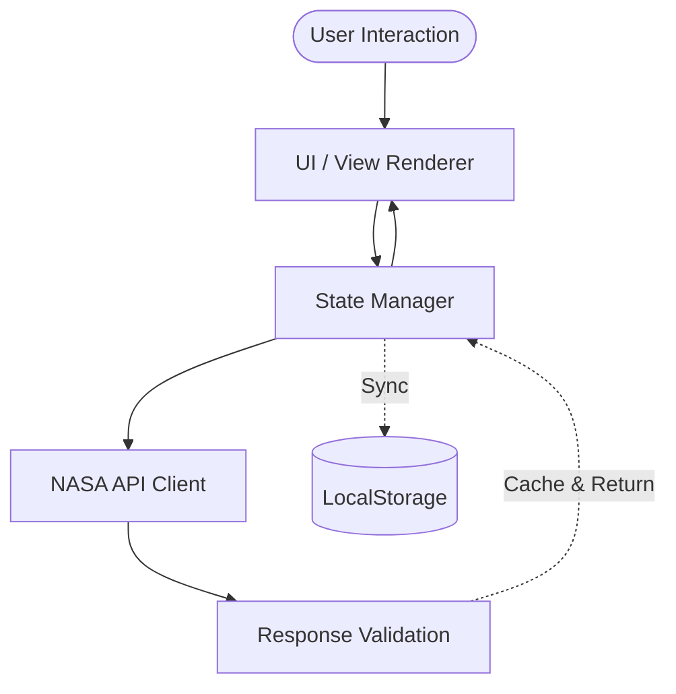

<div align="center">

# ✦ Cosmic APOD

### The universe, one day at a time.

A modern NASA Astronomy Picture of the Day explorer built for discovery, learning, and exploration.

[Live Demo](https://cosmic-apod.vercel.app) • [GitHub](https://github.com/gauravkhatriweb/cosmic-apod) • [NASA APOD API](https://api.nasa.gov/)

[](#)
[](#)
[](#)
[](#)
[](#)

</div>

---

Cosmic APOD is a modern, immersive web application that brings NASA's Astronomy Picture of the Day archive to life for space enthusiasts and educators through a seamless, highly polished discovery experience.

---

## ✨ What's New in V2

V2 completely transforms the prototype into a production-ready Single Page Application (SPA).

### 🔭 Discovery
- **Dashboard:** A daily portal featuring Today's APOD, "On This Day" (last year), and recent discoveries.
- **Explorer:** A dedicated archive view to shuffle randomly or browse the last 20 days.
- **Education Mode:** Expandable panels offering contextual cosmic insights.

### ❤️ Personalization
- **Favorites & History:** Slide-out panels to manage saved and recently viewed APODs.
- **Themes:** Support for Cosmic Dark and High Contrast modes.

### 🎨 Experience
- **SPA Architecture:** Seamless transitions between views without full page reloads.
- **Immersive Media:** Fullscreen lightbox for high-resolution images and integrated support for YouTube/Vimeo video APODs.
- **Reduced Motion:** Automatic disabling of canvas starfields and CSS transitions for users preferring reduced motion.

### ⚡ Engineering
- **Resilience:** Intelligent request caching and `AbortController` cancellation to handle rapid user navigation.
- **Error Recovery:** Graceful fallback UI for network failures.
- **Hardened Persistence:** Safe `localStorage` wrappers to prevent crashes from quota limits or corrupted data.

---

## ✨ Features

### 🌌 Explore
Navigate between the curated **Dashboard** and the sprawling **Explorer** grid to discover random APODs from the past three decades.

### 📅 Archive
Use the built-in date picker or keyboard-navigable arrows to seamlessly jump to any specific day in the NASA archive since June 1995.

### ❤️ Favorites
Save breathtaking cosmic imagery to your personal Favorites panel. Data is safely serialized and synced to your browser's local storage.

### 🕘 History
Never lose track of a discovery. The History panel automatically logs recently viewed APODs for quick retrieval.

### 🖼 Media
Enjoy uninterrupted viewing with a fullscreen lightbox for high-definition photography and native iframe embedding for video APODs.

### 📤 Sharing
Generate and copy deep links directly to a specific APOD date using the integrated Share action.

### 🎨 Personalization
Switch seamlessly between the default Cosmic Dark atmosphere or a High Contrast mode tailored for readability.

### ♿ Accessibility
Fully navigable via keyboard, trapped focus inside modals, screen-reader-friendly labels, visible focus rings, and strict adherence to OS-level motion preferences.

### ⚡ Performance
Skeleton loaders prevent layout shifts, while aggressive API caching and request cancellation keep the application lightning fast.

---

## ⚙️ How It Works



Cosmic APOD uses a clean, Vanilla JavaScript Single Page Application (SPA) architecture. User interactions dispatch updates to a centralized `store.js`. The store triggers the `nasa.js` API client, which handles rate limiting, caching, and race-condition prevention via `AbortController`. Once validated, the state changes trigger the UI to render the new data dynamically without page reloads, while persisting favorites, history, and settings to `localStorage`.

---

## 🛠 Tech Stack

| Technology | Role |
|---|---|
| **Vite** | Development server and production build |
| **Vanilla JavaScript** | Application logic, routing, and state management |
| **CSS** | Custom responsive UI, design system, and glassmorphism |
| **NASA APOD API** | The source of truth for daily astronomy data |
| **LocalStorage** | Client-side persistence for preferences and favorites |
| **GitHub Actions** | Automated CI/CD pipeline |

---

## 📁 Project Structure

```text
cosmic-apod/
├── .github/
│   └── workflows/
│       └── deploy.yml          # GitHub Actions deployment
├── public/
│   └── favicon.svg             # Application favicon
├── screenshots/                  
│   └── v1/                     # Deprecated V1 screenshots
├── src/
│   ├── api/                    # API client and caching
│   ├── components/             # Reusable UI components and modals
│   ├── state/                  # Centralized application store
│   ├── styles/                 # Theme variables
│   ├── utils/                  # Date, DOM, and storage helpers
│   ├── views/                  # Dashboard and Explorer logic
│   ├── main.js                 # Application entry and router
│   └── style.css               # Global stylesheets
├── .env.example
├── .gitignore
├── index.html
├── package.json
├── vite.config.js
└── README.md
```

---

## 🔌 NASA APOD API

This project retrieves its data directly from the [NASA Astronomy Picture of the Day API](https://api.nasa.gov/).

- **Endpoint:** `https://api.nasa.gov/planetary/apod`
- **Data Retrieved:** APOD title, date, explanation, media type, standard URL, and HD URL.
- **Rate Limits:** `DEMO_KEY` allows 30 requests/hour per IP. A personal API key allows 1,000 requests/hour.

> ⚠️ **Security Note:** Vite bundles variables prefixed with `VITE_` into the client-side code. This means your NASA API key will be visible in the browser network tab. This is perfectly acceptable for the free, public NASA API, but you should never use this pattern for sensitive credentials like database passwords or paid service tokens.

---

## 🚀 Local Development

### Requirements
- Node.js (v18 or higher)
- Git
- A [free NASA API key](https://api.nasa.gov/) (You can use `DEMO_KEY` temporarily, but rate limits apply).

### Installation

```bash
git clone https://github.com/gauravkhatriweb/cosmic-apod.git
cd cosmic-apod
npm install
```

### Environment Setup

Copy the example environment file:
```bash
cp .env.example .env
```

Open `.env` and insert your NASA API key:
```env
VITE_NASA_API_KEY=your_api_key_here
```
*(Note: `.env` is ignored by Git and will not be committed.)*

### Development

```bash
npm run dev
```

### Production Build

```bash
npm run build
npm run preview
```

---

## 🌐 Deployment

The project is configured to deploy automatically via GitHub Actions (`.github/workflows/deploy.yml`) to GitHub Pages. It can also be seamlessly deployed to Vercel.

To deploy your own instance:
1. Ensure your hosting platform supports Node.js/Vite builds.
2. Set the Build Command to `npm run build`.
3. Set the Output Directory to `dist`.
4. Add your `VITE_NASA_API_KEY` as an environment variable in your deployment platform's dashboard or GitHub Secrets.

---

## ♿ Accessibility

Cosmic APOD treats accessibility as a first-class citizen:
- **Keyboard Navigation:** All grid cards, buttons, and panels are fully navigable via `Tab`, `Enter`, and `Space`.
- **Focus Trapping:** Opening the Lightbox, Settings, or Side Panels traps keyboard focus so screen-reader users don't accidentally navigate the hidden background.
- **Semantic HTML:** Strict usage of `<main>`, `<article>`, `<aside>`, `<time>`, and `<header>` roles.
- **Reduced Motion:** Canvas animations and CSS hover transitions are completely disabled if the user's OS requests `prefers-reduced-motion` or via the in-app toggle.
- **Clear Indicators:** Visible focus rings (`outline: 2px solid`) ensure keyboard users know exactly where they are.

---

## ⚡ Performance

- **Lazy DOM Rendering:** Skeleton loaders are used while fetching to entirely prevent layout shift.
- **Request Cancellation:** Navigating rapidly through dates uses `AbortController` to cancel in-flight API requests, saving bandwidth and preventing race conditions.
- **Aggressive Caching:** Once an APOD is fetched, it is stored in a fast in-memory cache to prevent duplicate network calls.
- **Framework-less:** By avoiding heavy frameworks like React or Vue, the final bundled application payload is exceptionally small and parses instantly.

---

## 🎨 Design Philosophy

> Cosmic APOD treats astronomy as an experience rather than simply an API response. The interface combines deep-space visuals, cinematic media presentation, restrained motion, and clear information hierarchy without allowing decoration to interfere with usability.

---

## 🔄 V1 → V2 Evolution

| Area | V1 (Prototype) | V2 (Production) |
|---|---|---|
| **Architecture** | Single static view | Multi-view SPA with virtual routing |
| **Discovery** | Single date picker | Dedicated Dashboard and Explorer views |
| **Networking** | Basic fetch | Caching, `AbortController`, graceful fallbacks |
| **Accessibility** | Basic | Focus trapping, robust keyboard support, reduced motion |
| **Resilience** | Brittle storage | Hardened local storage fallbacks |
| **Media** | Standard viewer | Advanced fullscreen Lightbox |

---

## 🗺 Roadmap

### ✅ Completed — V2
- Single Page Application architecture
- Dashboard and Explorer views
- Theming and Settings panel
- Focus trapping and A11y hardening
- AbortController and caching

### 🚧 Next — V2.x
- Machine learning-based image tagging
- Date range filtering within the Explorer view
- Shareable Collections

### 🔭 Future — V3
- Full Offline PWA support with Service Workers
- WebGL enhanced stargazing background

---

## 🤝 Contributing

Contributions are welcome!

1. Fork the repository
2. Create your feature branch (`git checkout -b feature/amazing-feature`)
3. Commit your changes (`git commit -m 'Add some amazing feature'`)
4. Test locally (`npm run dev`)
5. Push to the branch (`git push origin feature/amazing-feature`)
6. Open a Pull Request

---

## 📄 License

Currently, this repository does not include a LICENSE file. Licensing needs to be added appropriately before formal distribution or contribution guidelines can be legally enforced.

---

## 🙏 Acknowledgements

- **[NASA APOD API](https://api.nasa.gov/)** for providing decades of breathtaking astronomical data.
- **[Hack Club Stardance](https://stardance.hackclub.com/missions/nasa-page)** for the original mission inspiration.

---

<div align="center">

### ✦ Explore something new every day.

Built with curiosity and the NASA APOD API.

[Live Demo](https://cosmic-apod.vercel.app) · [Repository](https://github.com/gauravkhatriweb/cosmic-apod)

</div>
